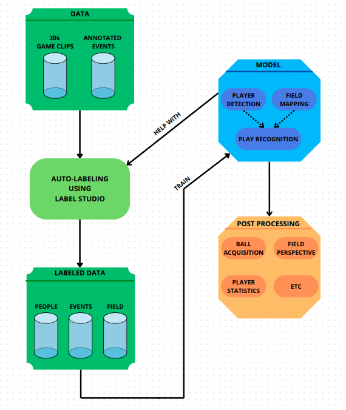

# 🏟️ PitchAnalyzer_AI
By [Blaku03](https://github.com/Blaku03) and [gruzewson](https://github.com/gruzewson)

## 🧭 Overview

**PitchAnalyzer_AI** is a sports analytics framework designed to turn raw football match video into actionable insights. At its core, the system:

- **Detects** players and the ball in each frame.  
- **Assigns** each player to their team.  
- **Tracks** players and ball trajectories over time.  
- **Maps** camera views to a bird’s‑eye perspective.  
- **Aggregates** events into game statistics (possession, heatmaps, distance covered, etc.) for post‑match review.

For a detailed breakdown of modules, data formats, augmentation strategies, training recipes, and usage examples, see our full [Documentation](technical_documentation.md).  

## Table of Contents

-  [🎦Demo](#demo)
-  [👀Try it out!](#try-it-out)
-  [⚙️Project workflow](#project-workflow)
-  [🔜Future plans](#future-plans)

##  🎦 Demo

Here’s a quick demo of PitchAnalyzer_AI in action: first the raw video input, then the analyzed output with detections, tracking and statistics.

##  👀 Try it out!

Explore the project in action with interactive Jupyter Notebooks!

You'll find them in the development_and_analysis directory — ready to run locally or directly on Kaggle.

### 📌 Featured Notebooks on Kaggle:
- [🎮 Game Annotation & Statistics](https://www.kaggle.com/code/blaku03/gameannotator)
- [🗺️ Mapping Players to a 2D Pitch](https://www.kaggle.com/code/blaku03/pitchmapping)
- [🏋️ Training YOLOv11 for Player Detection](https://www.kaggle.com/code/blaku03/gamemodeltraining)

##  ⚙️ Project workflow

1. **Raw Data & Events**  
   - 30 s match clips + manually logged events as inputs.

2. **Auto‑Labeling (Label Studio)**  
   - Semi‑automated generation of player/ball bounding boxes and pitch keypoints, with model‑assisted corrections.

3. **Model Training**  
   - YOLOv11 for player/ball detection  
   - Keypoint detector + homography for field mapping  
   - Play‑recognition module combining detections and geometry

4. **Post‑Processing & Analytics**  
   - Derive ball possession, player heatmaps, bird’s‑eye view, distances covered, and other stats from model outputs.

##  🔜Future plans

When we have more time, we plan to:

- Develop a model for detecting specific plays and game strategies.
- Improve the accuracy and robustness of our current models for player and ball detection.
- Expand the range of statistics generated, such as advanced metrics for player performance and team dynamics.
- Implement a more sophisticated method for recognizing teams, potentially replacing KNN with a deep learning-based approach for better accuracy and scalability.