## 🧭 Overview

This project, PitchAnalyzer_AI, is a sports analytics tool designed to analyze football matches using computer vision and machine learning. It detects players, the ball, and key pitch features, tracks movements, and generates game statistics. The system employs YOLO for object detection, KNN for team assignment, and trackers like ByteTracker and Norfair for robust tracking. It also uses homography mapping to create a bird's-eye view of the pitch for better spatial analysis.

To learn how to run the project, refer to the [README.md](README.md). It provides details on the project workflow and setup along with the demo.


## 📚 Table of Contents

-  [🧗Challenges](#challenges)
    -  [📹 Non-Deterministic Camera Angles](#non-deterministic-camera-angles)
    -  [🌤️ Lightning variety in videos](#lightning)
    -  [🖥️ Lack of Computational Power](#computational-power)
-  [📁Project Structure](#project-structure)
-  [⚽Dataset](#dataset)
    - [📦Source](#source)
    - [🎞Format](#format)
    - [🏷Labeling with Label Studio](#label-studio)
    - [🧬Augmentation](#augmentation)
-  [📊Getting Game Data](#getting-game-data)
    - [👁Detecting players with YOLO](#detecting-players-with-yolo)
    - [👥KNN for Splitting into Teams](#knn-for-splitting-into-teams)
    - [🛰Trackers](#trackers)
    - [Statistics](#statictics)
- [🏟️ Getting Pitch Data](#pitch-data)
    - [📍Detecting Pitch Keypoints](#pitch-keypoints)
    - [🗺Homography Mapping](#homography-mapping)
- [🏋Training](#training)
    - [📋Yolo parameters](#yolo-parameters)
    - [☁Online Training on Kaggle](#online-training)
- [📝Observations](#observations)


## <a name="challenges"></a> 🧗Challenges

### <a name="non-deterministic-camera-angles"></a> 📹 Non-Deterministic Camera Angles

One of the primary challenges in analyzing football pitch videos is the variability in camera angles. 

This issue introduces several complications:

1. **Player and Referee Exclusion**:  
   Non-deterministic camera angles can result in certain players or referees being excluded from the frame. This makes it difficult to track individual statistics accurately.

2. **Incomplete Field Coverage**:  
   The camera may not capture the entire pitch, leading to gaps in the spatial data required for mapping and analysis.

3. **Dynamic Movement**:  
   The dynamic nature of the game, combined with inconsistent camera panning, can cause players or the ball to move out of the frame temporarily, disrupting tracking continuity.

4. **Occlusions**:  
   Players or referees may obstruct the view of the ball or other players, further complicating object detection and tracking.

**Solution**:
To address the challenges of non-deterministic camera angles, a bird's eye view model of the pitch is created using homography mapping, ensuring consistent spatial representation. Ball interpolation techniques and dynamic player identification are employed to maintain tracking continuity and gather statistics without relying on unique player IDs.

### <a name="lightning"></a> 🌤️ Lightning variety in videos 
---

One of the significant challenges in analyzing football pitch videos is the variability in lighting conditions. These variations can arise due to different weather conditions, stadium lighting setups, or the time of day when the match is played. 

<p align="center">
  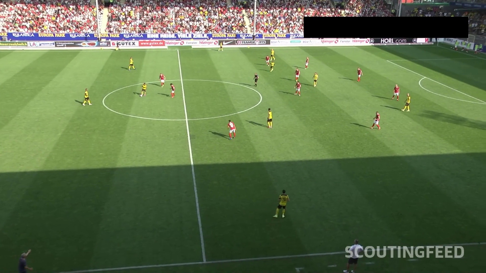
  
</p>

Key issues include:

1. **Shadows and Contrasts**:  
   Shadows cast by players, referees, or stadium structures can obscure parts of the pitch, making it difficult to detect and track objects accurately. High contrast between brightly lit areas and shadows further complicates object detection.

2. **Weather Conditions**:  
   Weather variations, such as overcast skies, bright sunlight, or rain, can affect the visibility and quality of the video. These conditions introduce inconsistencies in the appearance of players, the ball, and the pitch.

3. **Artificial Lighting in Stadiums**:  
   Stadium lighting can vary significantly, with some setups causing glare or uneven illumination across the pitch. This can lead to challenges in maintaining consistent detection and tracking performance.

**Solution**:
To address lighting variability, a wide augmentation strategy was implemented, including adjustments for brightness simulate diverse conditions. This ensures the model is robust to weather changes, stadium lighting differences, and other inconsistencies in video footage.

If You want to know more about our solution go here: [Augmentation](#augmentation)

### <a name="computational-power"></a> 🖥️ Lack of Computational Power 
---

One of the major challenges faced during the development of our system was the lack of access to high-performance GPUs for training our models. 

To overcome this limitation, we utilized Kaggle's online platform, which provides access to GPUs with a restricted time limit for usage. While this allowed us to train our models to some extent, the available computational power was still insufficient to achieve the desired level of performance and optimization. As a result, further improvements in training efficiency and access to more powerful hardware remain critical for advancing our solution.


## <a name="project-structure"></a>📁 Project Structure

```
📦 PitchAnalyzer_AI
┣ 📂 annotators
┃   ╰─ Contains classes responsible for annotating video frames with key data, such as player positions, ball location, and game events. These annotations provide the foundation for visualizing and interpreting game statistics.
┣ 📂 assigners
┃   ╰─ Includes classes that assign players to their respective teams and link the ball to the controlling player. This functionality is critical for tracking team dynamics and individual contributions during the game.
┣ 📂 development_and_analysis
┃   ╰─ Houses Jupyter notebooks demonstrating various use cases of the system, such as testing tracking algorithms, analyzing statistical outputs, and exploring visualization techniques for game data.
┣ 📂 mapping_2d
┃   ╰─ Contains logic for converting the football pitch from video footage into a 2D representation. This mapping enables precise tracking of player movements and ball positions relative to the pitch’s layout.
┣ 📂 model_dataclasses
┃   ╰─ Stores data classes that define the structure of machine learning models used in the system. These classes organize and manage the data processed by the models for tracking and analysis.
┣ 📂 sample_data
┃   ╰─ Provides example datasets, including video clips of football games, annotation files, and pre-processed data, useful for testing and showcasing the system’s capabilities.
┣ 📂 trackers
┃   ╰─ Comprises classes for tracking game elements like players, the ball, and the field itself. These trackers integrate with annotators and assigners to produce comprehensive game statistics.
┣ 📂 training_notebooks
┃   ╰─ Contains Jupyter notebooks used to train the machine learning models that drive the tracking and analysis features. These notebooks include steps for model training, evaluation, and optimization.
┣ 📂 utils
┃   ╰─ Offers utility scripts for common tasks, such as importing video files, loading pre-trained models, and preprocessing data, enhancing development and deployment efficiency.
```

## <a name="dataset"></a> ⚽ Dataset 

### <a name="source"></a> 📦 Source

Our dataset originates from a Kaggle competition that inspired this project. While the original data was removed, we found a mirror copy:
- [Copy of the dataset](https://www.kaggle.com/datasets/saberghaderi/-dfl-bundesliga-460-mp4-videos-in-30sec-csv)
- [Original competition](https://www.kaggle.com/competitions/dfl-bundesliga-data-shootout)

### <a name="format"></a> 🎞️ Format

Each clip captures real-time player movement and game flow. For training, we extracted 5 random frames per clip, giving us a wide variety of:
- Player positions
- Ball locations
- Game events

### <a name="label-studio"></a> 🏷️ Labeling with Label Studio
We used Label Studio for annotation thanks to its auto-labeling feature. After training an initial model, we used it to auto-label frames, then manually corrected mistakes.
This saved tons of time — each frame has ~20 players + the ball, so full manual labeling would've been very time-consuming.


**Important note:** There are rendering issues with Label Studio when using chromium browsers like Brave. For our experience, Firefox worked best. If you encounter issues, try switching to Firefox.


### <a name="augmentation"></a> 🧬 Augmentation
---

**Our Augmentation**  

To simulate various lighting conditions, such as shadows or sunny days in the stadium, we applied transformations to the images by randomly selecting a fraction of the image to brighten or darken. These transformations were applied either vertically or horizontally to mimic real-world lighting variations on the pitch. Labels on the original image were copied with name corresponding to an image.

Below is an example of the original image followed by a grid of augmented images showcasing different transformations applied to simulate real-world lighting conditions.

#### Original Image
<p align="center">
  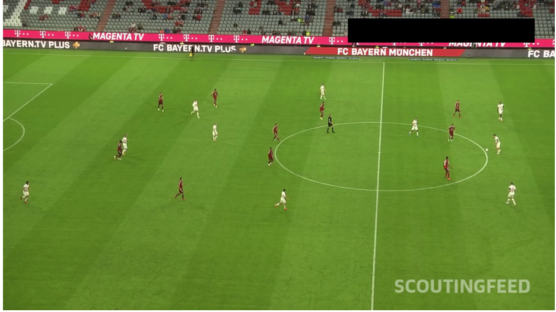
</p>

#### Augmented Images
<p align="center">
  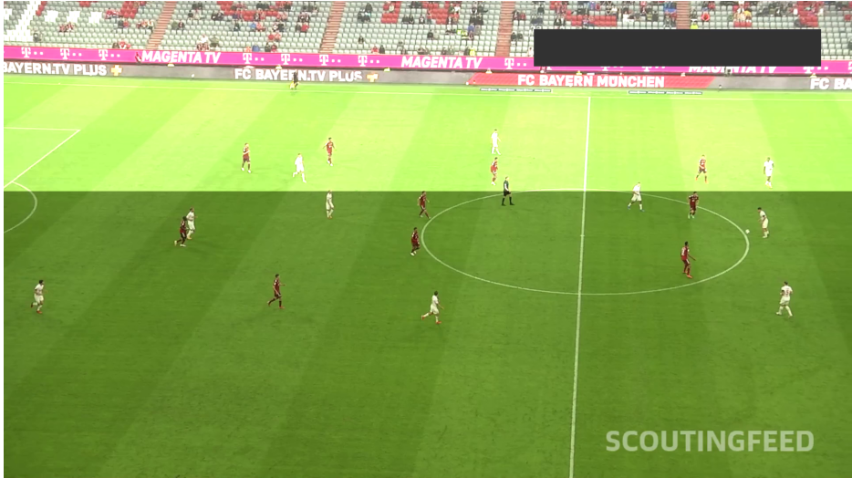
  
</p>
<p align="center">
  
  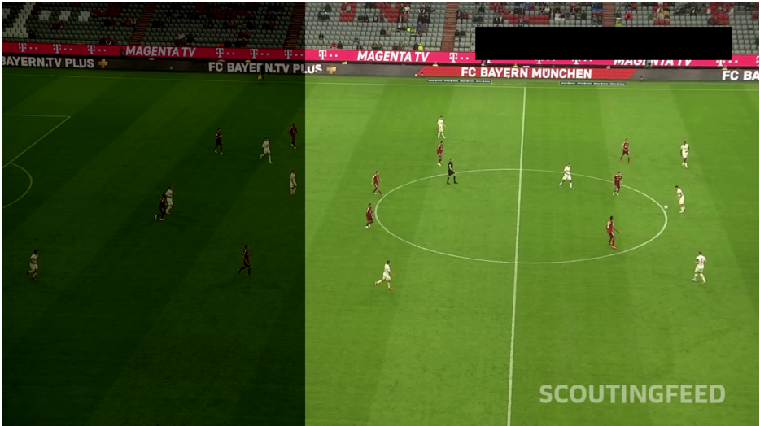
</p>


**Top Left**: Brightened vertically to simulate sunlight on one side of the pitch.

**Top Right**: Darkened vertically to mimic shadows cast by stadium structures.

**Bottom Left**: Brightened horizontally to replicate uneven lighting across the pitch.

**Bottom Right**: Darkened horizontally to simulate overcast or shaded conditions.

You can find the implementation details in the following file: [here](augmentation.ipynb)

 **YOLO parameters augmentation**

 YOLO provides built-in options to apply various augmentations during training, allowing the model to generalize better to diverse scenarios. These augmentations include adjustments for saturation, brightness, translation, scaling, and more. The parameters for these augmentations are configurable and can be found in the training notebook. By default, many of these augmentations are turned off, but they can be enabled and fine-tuned as needed to suit specific training requirements.

 This is augmentations we used (for specific values go [here](#training)):

**🌈 Saturation Adjustment**  

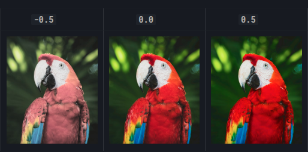  

Modifies color intensity by increasing or decreasing saturation by up to 100%. Higher values make colors pop, while lower values simulate washed‑out or desaturated scenes.  
- **Range:** ±1.0 of normalized saturation (0–1)   

---

**☀️ Brightness Adjustment**  

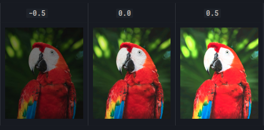  

Alters overall luminance by up to ±70%, brightening under‑exposed frames or darkening over‑exposed ones.  
- **Range:** ±0.7 of normalized value (0–1)  

---

**↔️ Translation**  

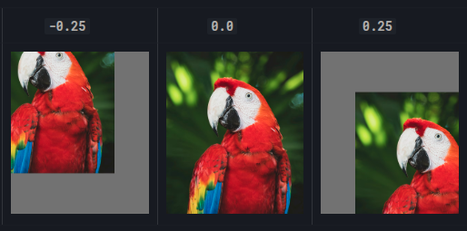

Shifts the image up to ±10% along the X and Y axes, moving players and the ball within the frame. Emulates slight camera panning or player drift, helping the model track partially off‑center objects 
- **Range:** ±0.1 of image width/height  


---

**🔍 Scaling (`scale=0.0`)**  
Resizes the image by a random factor; here disabled (0%), but when enabled it can zoom in/out by a set range.  
- **Range:** e.g. 0.8–1.2 for ±20% zoom  

---

**🧩 Mosaic (`mosaic=0.0`)**  
Stitches four randomly‑selected images into one composite quad. When enabled, each quadrant contributes part of an image and its labels.  
- **Probability:** 0–1 (here 0% disabled)  

---

**🤖 AutoAugment (`auto_augment=autoaugment`)**  
 
Applies a fixed policy of complex transforms (e.g. shearing, posterizing, solarizing) drawn from Torchvision’s AutoAugment library.  
- **Modes:**  
  - `randaugment` (random ops & magnitudes)  
  - `autoaugment` (ImageNet‑learned policy)  
  - `augmix` (mixes multiple short augment chains)  
- **Use case:** Infuses additional color, geometric, and texture variations without manual tuning.


## <a name="getting-game-data"></a> 📊 Getting Game Data

### <a name="detecting-players-with-yolo"></a> 👁️ Detecting Players with YOLO

For detecting players, we decided to use the YOLO model which is a state-of-the-art object detection algorithm. 
YOLO (You Only Look Once) is known for its speed and accuracy in real-time object detection tasks.
We have chosen the newest YOLOv11x model, where X stands for the size of the model.

It is summarized in the table below:

| Model    | Size | Use Case |
|----------|------|----------|
| YOLOv11n | Nano | Edge/IoT, mobile, real-time with constraints |
| YOLOv11s | Small |  General real-time, resource-limited devices |
| YOLOv11m | Medium | Balanced: good accuracy, efficient compute |
| YOLOv11l | Large |  High-accuracy on powerful hardware |
| YOLOv11x | Extra Large | Maximum accuracy, cloud, research, servers |

Raw model produces following results:

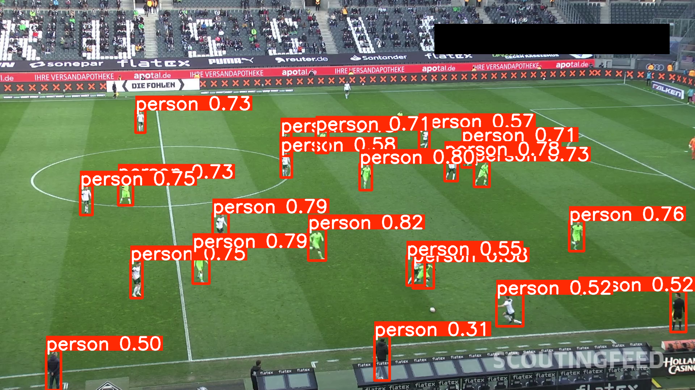

We can see a few problems with the model:
1. It does not detect all players
2. It does not detect the ball
3. It detects coaches and other objects

After training the model on our dataset (more about it in the [training](#training) section), we achieved a significant improvement in detection accuracy. The trained model is capable of detecting players and the ball with high precision, while also filtering out irrelevant objects like coaches and other non-game elements.

With annotation result is following:

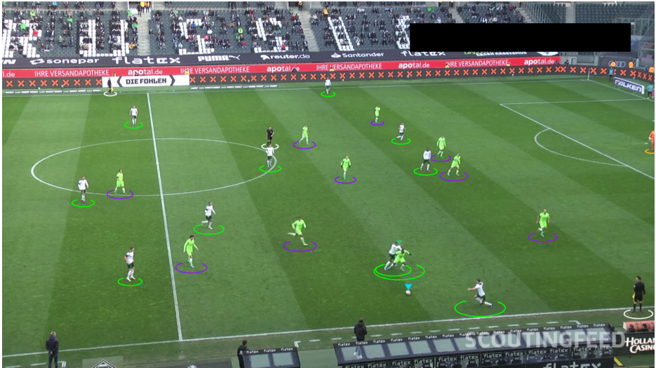

### <a name="knn-for-splitting-into-teams"></a> 👥 KNN for splitting into teams

**Initializing**

To split players into teams, we first sample a handful of frames and extract each player’s dominant shirt‑color vector (an RGB centroid) by running a tiny two‑cluster K‑Means within their upper‑body crop. Those color vectors are then fed into a second K‑Means (with _k_ = 2) to learn the two “team‑color” centroids.

**Assigning Teams**

Once initialized, every new player detection has its shirt color extracted the same way and is simply assigned to whichever centroid it’s nearest in RGB space—automatically labeling them as Team 1 or Team 2. We then cache each tracker ID’s team assignment so that, as players move around or momentarily leave the frame, their team label remains consistent throughout the match.

Example of extracting color of the shirt:

**Original player image**

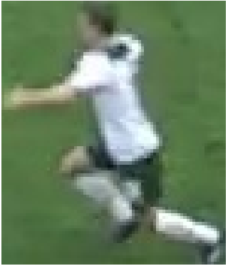

**Extracted color of the shirt**

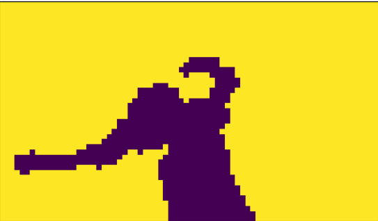

### <a name="trackers"></a> 🛰️ Trackers

We used two trackers to track players and the ball.

1. **ByteTracker**: A state-of-the-art object tracking algorithm that uses a combination of Kalman filtering and the Hungarian algorithm for data association. It is known for its high accuracy and robustness in tracking multiple objects in real-time.

2. **Norfair**: ByteTracker is a powerful tracker, but it can be sensitive to low-confidence detections and may delete tracks if the object is not detected for a while. That's why we decided to use Norfair tracker which is a lightweight and easy-to-use object tracking library. It predicts the next position of the object based on its previous position and velocity, and it can handle occlusions and missed detections more gracefully than other trackers.

### <a name="statistics"></a> 📈 Statictics
We currently calculate the possession of ball for each team.
It is calculated by counting the number of frames in which each team has the ball.

There is a marker that shows the player closest to the ball.
There is also a threshold which is used to determine if the player is close enough to the ball to be considered as possessing it.

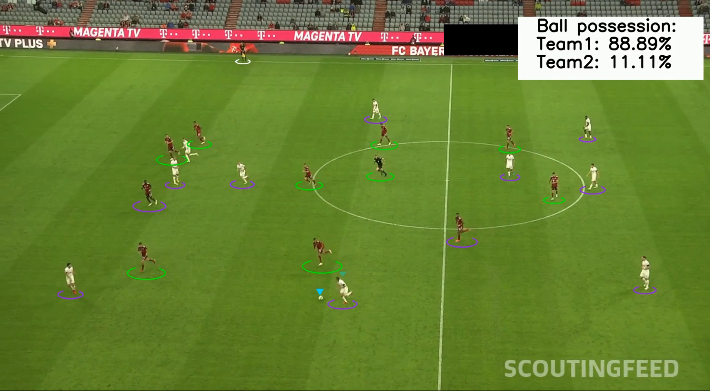

## <a name="pitch-data"></a> 🏟️ Getting Pitch Data

### <a name="pitch-keypoints"></a> 📍 Detecting Pitch Keypoints

To accurately map the football pitch, we need to identify key points on the field.
We used a YOLO model to detect these key points, which include the corners of the pitch, the center circle, and other significant markers.
By training the model on annotated images of the pitch, we can achieve high accuracy in detecting these key points.

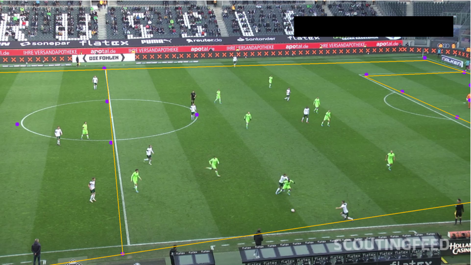

These key points serve as reference markers for homography mapping, allowing us to create a consistent 2D representation of the pitch.

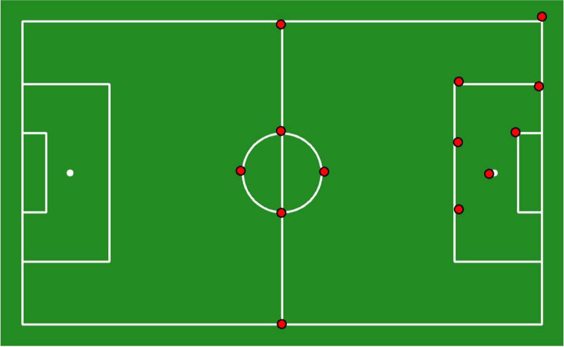

### <a name="homography-mapping"></a> 🗺️ Homography Mapping

Homography mapping is a technique used to transform the perspective of an image to a top-down view. This is particularly useful in sports analytics, where we want to analyze player movements and ball trajectories from a bird's-eye perspective.
The process involves the following steps:
1. **Key Point Detection**: Use the YOLO model to detect key points on the pitch.
2. **Homography Matrix Calculation**: Calculate the homography matrix using the detected key points and their corresponding locations in a top-down view of the pitch.
3. **Image Transformation**: Apply the homography matrix to transform the 
orignal points in the image to their corresponding locations in the top-down view.
4. **Visualization**: Overlay the transformed image with player and ball positions to create a comprehensive view of the game.

Example of the original image and the transformed image:

<p align="center">
  
  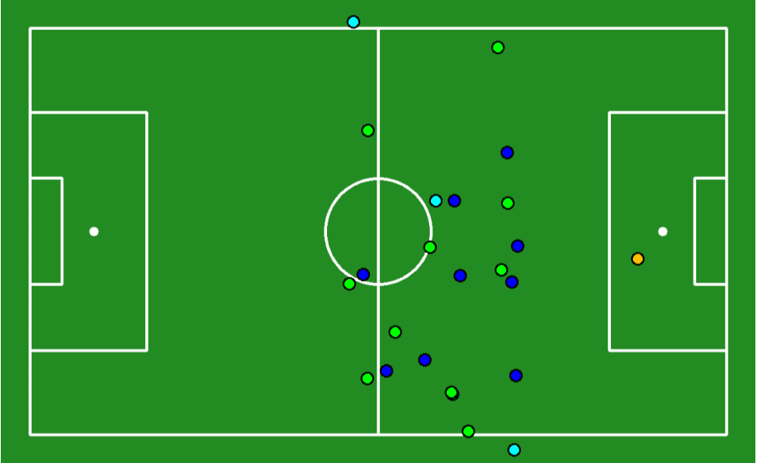
</p>

## <a name="training"></a> 🏋️ Training

### <a name="yolo-parameters"></a> 📋 YOLO parameters

**Performance**

We managed to find a best approach to maximize both the `image_size` and `batch_size` while staying within the GPU memory constraints. This balance ensures high-quality input images for better detection accuracy while maintaining an efficient training process.

- **`image_size`**: Defines the resolution of the input images. A larger `image_size` improves the model's ability to detect smaller objects (e.g., the ball) but increases memory usage and computation time.  
- **`batch_size`**: Specifies the number of images processed simultaneously during training. A higher `batch_size` stabilizes gradient updates and speeds up training but requires more GPU memory.

By setting `image_size = 1280` and `batch_size = 6`, we achieved a configuration that optimizes both detection performance and training efficiency.

**Augmentation parameters**

Our current configuration for the augmentation parameters is:

```
hsv_h=0.1,
hsv_s=1.0,
hsv_v=0.7,
translate=0.1,
scale=0.0,
mosaic=0.0,
auto_augment='autoaugment'
```

Other augmentations are turned of by default.
If you want to know more about these augmentations check this [augmentation](#augmentation) section.

### <a name="online-training"></a> ☁️ Online Training with Kaggle

Kaggle provides an excellent platform for training machine learning models, offering free access to GPUs and TPUs. This is particularly useful for resource-intensive tasks like training YOLO models. By leveraging Kaggle's computational resources, we can train our models efficiently without the need for expensive hardware.

**Steps to Train on Kaggle:**
1. Upload your dataset to a Kaggle Dataset or use an existing public dataset.
2. Create a Kaggle Notebook and configure it to use a GPU by selecting **Settings > Accelerator > GPU**.
Or use our [notebook](https://www.kaggle.com/code/blaku03/gamemodeltraining).
3. Install the required dependencies (e.g., PyTorch, YOLO libraries).
4. Upload your training script or write it directly in the notebook.
5. Start the training process and monitor the progress using Kaggle's built-in tools.

**Advantages of Kaggle:**
- Free access to GPUs (e.g., NVIDIA Tesla P100 or T4).
- Easy integration with datasets hosted on Kaggle.
- Collaborative environment for sharing and improving code.

For more details, visit the Kaggle Notebooks platform: [Kaggle Notebooks](https://www.kaggle.com/code)

By utilizing Kaggle's resources, we can overcome hardware limitations and focus on optimizing our model's performance.

## <a name="observations"></a> 📝 Observations

One of the potential issues encountered during training is model overfitting. Overfitting occurs when the model performs exceptionally well on the training data but fails to generalize to unseen data. This can happen due to excessive training on a limited dataset or insufficient data augmentation.

**Indicators of Overfitting:**
- High accuracy on the training set but significantly lower accuracy on the validation set.
- Poor performance when tested on new or unseen data.

**Mitigation Strategies:**
1. **Data Augmentation:** Apply diverse augmentations (e.g., brightness, translation, scaling) to increase the variability in the training data and improve the model's robustness.
2. **Regularization Techniques:** Use methods like dropout or weight decay to prevent the model from relying too heavily on specific features.
3. **Early Stopping:** Monitor validation loss during training and stop the process when the loss stops improving.
4. **Increase Dataset Size:** Incorporate more diverse data to help the model learn a broader range of scenarios.

By addressing overfitting, we can ensure that the model performs consistently across both training and real-world data.