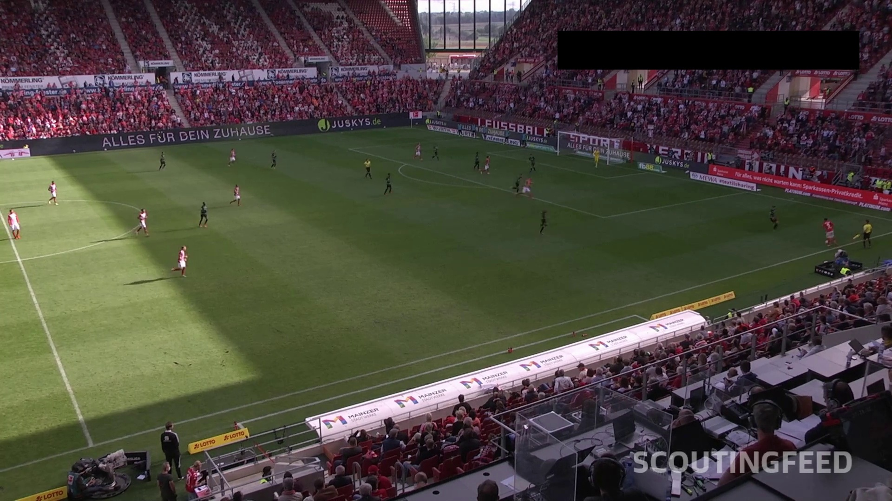
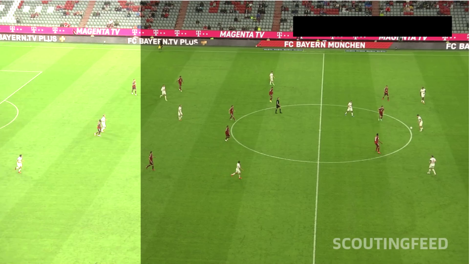

- Project structure

- Challenges
    - Camera angles
    - Wheather
    - Different shirt colors
    - Ball can be hidden from the camera (player is in front of it)
    - Ball is small and fast moving
- Dataset
    - source (kaggle competition)
    - format (30 sec clips)
    - Label studio
        - auto annotawanie itp
    - Augemntation (pokazac raw zdjecie i skad pomysl na nasze aug)
- Getting game data
    - YOLO for detecting players
    - KNN for splitting into teams
        - (initialization of KNN) 
    - Trackers used
        - Byte tracker
        - Norfair
    - Statictsic
- Pitch data
    - Detecting pitch keypoints
    - Homography mapping
- Training
    - Yolo paraters
        - Performance
        - Aug parameters
    - Online training kaggle
- Tips for creating similar project
    - Model can be overfitted
- Improving current project
    - Seprate model for players and ball

## Table of Contents

-  [Challenges](#challenges)
-  [📁Project Structure](#project-structure)
-  [⚽Dataset](#dataset)
    - [Source](#source)
    - [Format](#format)
    - [Label Studio](#label-studio)
    - [Augmentation](#augmentation)
- [Getting Game Data](#getting-game-data)
    - [Detecting players with YOLO](#detecting-players-with-yolo)
    - [KNN for Splitting into Teams](#knn-for-splitting-into-teams)
    - [Trackers Used](#trackers-used)
- [Pitch Data](#pitch-data)
    - [Detecting Pitch Keypoints](#detecting-pitch-keypoints)
    - [Homography Mapping](#homography-mapping)
- [Training](#training)
    - [Augmentation Parameters](#augmentation-parameters)
    - [Online Training on Kaggle](#online-training-on-kaggle)
- [Observations](#observations)


## Challenges

### 📹 Non-Deterministic Camera Angles

One of the primary challenges in analyzing football pitch videos is the variability in camera angles. 

This issue introduces several complications:

1. **Player and Referee Exclusion**:  
   Non-deterministic camera angles can result in certain players or referees being excluded from the frame. This makes it difficult to track individual statistics accurately.

2. **Incomplete Field Coverage**:  
   The camera may not capture the entire pitch, leading to gaps in the spatial data required for mapping and analysis.

3. **Dynamic Movement**:  
   The dynamic nature of the game, combined with inconsistent camera panning, can cause players or the ball to move out of the frame temporarily, disrupting tracking continuity.

4. **Occlusions**:  
   Players or referees may obstruct the view of the ball or other players, further complicating object detection and tracking.

**Solutions**:
To address the challenges of non-deterministic camera angles, a bird's eye view model of the pitch is created using homography mapping, ensuring consistent spatial representation. Ball interpolation techniques and dynamic player identification are employed to maintain tracking continuity and gather statistics without relying on unique player IDs.

### 🌤️ Lightning variety in videos 
---

One of the significant challenges in analyzing football pitch videos is the variability in lighting conditions. These variations can arise due to different weather conditions, stadium lighting setups, or the time of day when the match is played. 

<p align="center">
  
  
</p>

Key issues include:

1. **Shadows and Contrasts**:  
   Shadows cast by players, referees, or stadium structures can obscure parts of the pitch, making it difficult to detect and track objects accurately. High contrast between brightly lit areas and shadows further complicates object detection.

2. **Weather Conditions**:  
   Weather variations, such as overcast skies, bright sunlight, or rain, can affect the visibility and quality of the video. These conditions introduce inconsistencies in the appearance of players, the ball, and the pitch.

3. **Artificial Lighting in Stadiums**:  
   Stadium lighting can vary significantly, with some setups causing glare or uneven illumination across the pitch. This can lead to challenges in maintaining consistent detection and tracking performance.

**Solutions**:
To address lighting variability, a wide augmentation strategy was implemented, including adjustments for brightness simulate diverse conditions. This ensures the model is robust to weather changes, stadium lighting differences, and other inconsistencies in video footage.

If You want to know more about our solution go here: [Augmentation](#augmentation)

### 🖥️ Lack of Computational Power 
---

One of the major challenges faced during the development of our system was the lack of access to high-performance GPUs for training our models. 

To overcome this limitation, we utilized Kaggle's online platform, which provides access to GPUs with a restricted time limit for usage. While this allowed us to train our models to some extent, the available computational power was still insufficient to achieve the desired level of performance and optimization. As a result, further improvements in training efficiency and access to more powerful hardware remain critical for advancing our solution.


## <a name="project-structure"></a>📁 Project Structure

The PitchAnalyzer AI project is structured to modularize its functionalities, making it easier to develop, maintain, and extend the system for tracking football game statistics. By analyzing video footage, the system tracks players, the ball, and other game elements to generate detailed insights. Below is an overview of the main directories and their specific purposes:

```
📦 PitchAnalyzer_AI
┣ 📂 annotators
┃   ╰─ Contains classes responsible for annotating video frames with key data, such as player positions, ball location, and game events. These annotations provide the foundation for visualizing and interpreting game statistics.
┣ 📂 assigners
┃   ╰─ Includes classes that assign players to their respective teams and link the ball to the controlling player. This functionality is critical for tracking team dynamics and individual contributions during the game.
┣ 📂 development_and_analysis
┃   ╰─ Houses Jupyter notebooks demonstrating various use cases of the system, such as testing tracking algorithms, analyzing statistical outputs, and exploring visualization techniques for game data.
┣ 📂 mapping_2d
┃   ╰─ Contains logic for converting the football pitch from video footage into a 2D representation. This mapping enables precise tracking of player movements and ball positions relative to the pitch’s layout.
┣ 📂 model_dataclasses
┃   ╰─ Stores data classes that define the structure of machine learning models used in the system. These classes organize and manage the data processed by the models for tracking and analysis.
┣ 📂 sample_data
┃   ╰─ Provides example datasets, including video clips of football games, annotation files, and pre-processed data, useful for testing and showcasing the system’s capabilities.
┣ 📂 trackers
┃   ╰─ Comprises classes for tracking game elements like players, the ball, and the field itself. These trackers integrate with annotators and assigners to produce comprehensive game statistics.
┣ 📂 training_notebooks
┃   ╰─ Contains Jupyter notebooks used to train the machine learning models that drive the tracking and analysis features. These notebooks include steps for model training, evaluation, and optimization.
┣ 📂 utils
┃   ╰─ Offers utility scripts for common tasks, such as importing video files, loading pre-trained models, and preprocessing data, enhancing development and deployment efficiency.
```

##  Dataset ⚽

### 📦 Source
Our dataset originates from a Kaggle competition that inspired this project. While the original data was removed, we found a mirror copy:
- [Copy of the dataset](https://www.kaggle.com/datasets/saberghaderi/-dfl-bundesliga-460-mp4-videos-in-30sec-csv)
- [Original competition](https://www.kaggle.com/competitions/dfl-bundesliga-data-shootout)

### 🎞️ Format
Each clip captures real-time player movement and game flow. For training, we extracted 5 random frames per clip, giving us a wide variety of:
- Player positions
- Ball locations
- Game events

### 🏷️ Labeling with Label Studio
We used Label Studio for annotation thanks to its auto-labeling feature. After training an initial model, we used it to auto-label frames, then manually corrected mistakes.
This saved tons of time — each frame has ~20 players + the ball, so full manual labeling would've been very time-consuming.


**Important note:** There are rendering issues with Label Studio when using chromium browsers like Brave. For our experience, Firefox worked best. If you encounter issues, try switching to Firefox.


### 🧬 Augmentation
---


**Our Augmentation**  

To simulate various lighting conditions, such as shadows or sunny days in the stadium, we applied transformations to the images by randomly selecting a fraction of the image to brighten or darken. These transformations were applied either vertically or horizontally to mimic real-world lighting variations on the pitch. Labels on the original image were copied with name corresponding to an image.

Below is an example of the original image followed by a grid of augmented images showcasing different transformations applied to simulate real-world lighting conditions.

#### Original Image
<p align="center">
  
</p>

#### Augmented Images
<p align="center">
  
  
</p>
<p align="center">
  
  
</p>


**Top Left**: Brightened vertically to simulate sunlight on one side of the pitch.

**Top Right**: Darkened vertically to mimic shadows cast by stadium structures.

**Bottom Left**: Brightened horizontally to replicate uneven lighting across the pitch.

**Bottom Right**: Darkened horizontally to simulate overcast or shaded conditions.

You can find the implementation details in the following file: [here](augmentation.ipynb)

 **YOLO parameters augmentation**

 YOLO provides built-in options to apply various augmentations during training, allowing the model to generalize better to diverse scenarios. These augmentations include adjustments for saturation, brightness, translation, scaling, and more. The parameters for these augmentations are configurable and can be found in the training notebook. By default, many of these augmentations are turned off, but they can be enabled and fine-tuned as needed to suit specific training requirements.

 This is augmentations we used:

**🌈 Saturation Adjustment**  

  

Modifies color intensity by increasing or decreasing saturation by up to 100%. Higher values make colors pop, while lower values simulate washed‑out or desaturated scenes.  
- **Range:** ±1.0 of normalized saturation (0–1)   

---

**☀️ Brightness Adjustment**  

  

Alters overall luminance by up to ±70%, brightening under‑exposed frames or darkening over‑exposed ones.  
- **Range:** ±0.7 of normalized value (0–1)  

---

**↔️ Translation**  


Shifts the image up to ±10% along the X and Y axes, moving players and the ball within the frame. Emulates slight camera panning or player drift, helping the model track partially off‑center objects 
- **Range:** ±0.1 of image width/height  


---

**🔍 Scaling (`scale=0.0`)**  
Resizes the image by a random factor; here disabled (0%), but when enabled it can zoom in/out by a set range.  
- **Range:** e.g. 0.8–1.2 for ±20% zoom  

---

**🧩 Mosaic (`mosaic=0.0`)**  
Stitches four randomly‑selected images into one composite quad. When enabled, each quadrant contributes part of an image and its labels.  
- **Probability:** 0–1 (here 0% disabled)  

---

**🤖 AutoAugment (`auto_augment=autoaugment`)**  
 
Applies a fixed policy of complex transforms (e.g. shearing, posterizing, solarizing) drawn from Torchvision’s AutoAugment library.  
- **Modes:**  
  - `randaugment` (random ops & magnitudes)  
  - `autoaugment` (ImageNet‑learned policy)  
  - `augmix` (mixes multiple short augment chains)  
- **Use case:** Infuses additional color, geometric, and texture variations without manual tuning.


## Getting Game Data

### Detecting Players with YOLO

For detecting players, we decided to use the YOLO model which is a state-of-the-art object detection algorithm. 
YOLO (You Only Look Once) is known for its speed and accuracy in real-time object detection tasks.
We have chosen the newest YOLOv11x model, where X stands for the size of the model.

It is summarized in the table below:

| Model | Size | Use Case |
|-------|------|----------|
YOLOv11n | Nano | Edge/IoT, mobile, real-time with constraints
YOLOv11s | Small |  General real-time, resource-limited devices |
YOLOv11m | Medium | Balanced: good accuracy, efficient compute |
YOLOv11l | Large |  High-accuracy on powerful hardware |
YOLOv11x | Extra Large | Maximum accuracy, cloud, research, servers |

Raw models produces following results:


We can see a few problems with the model:
1. It does not detect all players
2. It does not detect the ball
3. It detects coaches and other objects

After training the model on our dataset (more about it in the [training](#training) section), we achieved a significant improvement in detection accuracy. The trained model is capable of detecting players and the ball with high precision, while also filtering out irrelevant objects like coaches and other non-game elements.

With annotation result is following:


### KNN for splitting into teams

**Initializing**

To split players into teams, we first sample a handful of frames and extract each player’s dominant shirt‑color vector (an RGB centroid) by running a tiny two‑cluster K‑Means within their upper‑body crop. Those color vectors are then fed into a second K‑Means (with _k_ = 2) to learn the two “team‑color” centroids.

**Assigning Teams**

Once initialized, every new player detection has its shirt color extracted the same way and is simply assigned to whichever centroid it’s nearest in RGB space—automatically labeling them as Team 1 or Team 2. We then cache each tracker ID’s team assignment so that, as players move around or momentarily leave the frame, their team label remains consistent throughout the match.

Example of extracting color of the shirt:

**Original player image**


**Extracted color of the shirt**


### 🎯 Trackers used

We used two trackers to track players and the ball.
The first one is a ByteTracker which is a state-of-the-art object tracking algorithm that uses a combination of Kalman filtering and Hungarian algorithm for data association. 
It is known for its high accuracy and robustness in tracking multiple objects in real-time.
We have notice that ByteTracker often deletes predictions when the confidence is low and the tracks are missing for a while.
That's why we decided to use Norfair tracker which is a lightweight and easy-to-use object tracking library.
It predicts the next position of the object based on its previous position and velocity, and it can handle occlusions and missed detections more gracefully than other trackers.

## 🎯 Training

### 📋 YOLO parameters

**Performance**

We managed to find a best approach to maximize both the `image_size` and `batch_size` while staying within the GPU memory constraints. This balance ensures high-quality input images for better detection accuracy while maintaining an efficient training process.

- **`image_size`**: Defines the resolution of the input images. A larger `image_size` improves the model's ability to detect smaller objects (e.g., the ball) but increases memory usage and computation time.  
- **`batch_size`**: Specifies the number of images processed simultaneously during training. A higher `batch_size` stabilizes gradient updates and speeds up training but requires more GPU memory.

By setting `image_size = 1280` and `batch_size = 6`, we achieved a configuration that optimizes both detection performance and training efficiency.


**Aug parameters**

Our current configuration for the augmentation parameters is:

```
hsv_h=0.1,
hsv_s=1.0,
hsv_v=0.7,
translate=0.1,
scale=0.0,
mosaic=0.0,
auto_augment='autoaugment'
```

Other augmentations are turned of by default.
If you want to know more about these augmentations check this [augmentation](#augmentation) section.